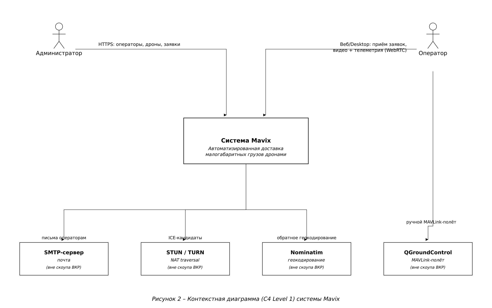
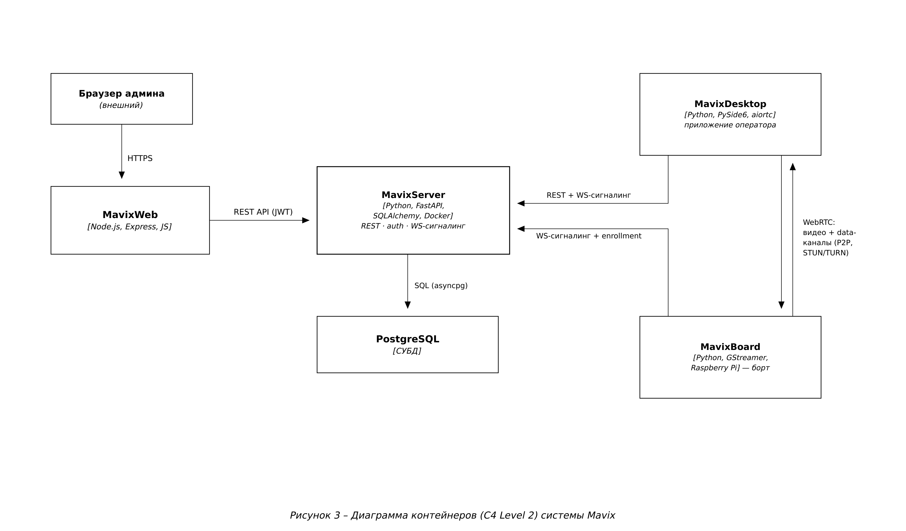

# Mavix — система автоматизированной доставки малогабаритных грузов

Mavix — программный комплекс для доставки малогабаритных грузов дронами:
администратор управляет парком дронов и операторами, формирует заявки на
доставку; операторы принимают заявки по принципу «такси» (кто первый принял —
тот и ведёт) и пилотируют дрон через интернет — видео в реальном времени,
телеметрия, карта, сброс груза.

> Изначально проект был эталонной системой удалённого пилотирования (FPV);
> ветка `remote_control` хранит её, а доставка разрабатывается в `delivery_control`.

## Архитектура

Система состоит из четырёх компонентов; связь — REST (JWT), WebSocket-сигналинг
и WebRTC (видео + data-каналы P2P через STUN/TURN).




| Компонент | Стек | Назначение | Репозиторий |
|---|---|---|---|
| **MavixServer** | Python · FastAPI · SQLAlchemy · PostgreSQL · Docker | REST API, авторизация (JWT, роли admin/operator), WS-сигналинг, журнал доставок | [MavixServer](MavixServer/README.md) |
| **MavixWeb** | Node.js · Express · vanilla JS | Лендинг, кабинет администратора (операторы, дроны, заявки, журнал), скачивание дистрибутивов | [MavixWeb](MavixWeb/README.md) |
| **MavixDesktop** | Python · PySide6 · aiortc | Приложение оператора: приём заявок, видео/телеметрия, карта, управление, сброс груза | [MavixDesktop-UI](MavixDesktop-UI/README.md) |
| **MavixBoard** | Python · GStreamer · Raspberry Pi | Борт на дроне: видео по WebRTC, проброс команд на полётный контроллер (CRSF/MAVLink) | [MavixBoard](MavixBoard/README.md) |

## Как это работает (поток доставки)

1. Администратор регистрируется, создаёт операторов (логин/пароль генерируются),
   скачивает дистрибутив борта; борт при первом запуске сам регистрируется
   (enrollment) и получает токен.
2. Администратор создаёт заявку на доставку (дрон + адрес/координаты/точка на
   карте). Заявка рассылается операторам в статусе `offered`.
3. Первый принявший оператор «захватывает» заявку (атомарно), подключается к
   дрону по WebRTC и ведёт доставку; по прибытии сбрасывает груз (AUX-канал),
   заявка переходит в `delivered`.

Подробнее — диаграммы вариантов использования и последовательностей в
[`assets/diagrams`](assets/diagrams/) (Use Case, Sequence: приём заявки,
установление WebRTC-сессии), модель данных (ER) и развёртывание (Deployment).

## Документация

- **Каждый компонент:** `README.md` (кратко), `TECHNICAL.md` (ГОСТ 19.402 —
  описание программы, со «Сложностями и принятыми решениями»), `USER_GUIDE.md`
  (ГОСТ 19.505 — руководство оператора).
- **Борт (железо):** [MavixBoard/HARDWARE_SETUP.md](MavixBoard/HARDWARE_SETUP.md)
  — Raspberry Pi, полётные контроллеры, UART и права на порты;
  [MavixBoard/WEBRTC_TURN_NOTES.md](MavixBoard/WEBRTC_TURN_NOTES.md) — разбор
  совместимости aiortc ↔ webrtcbin и TURN/ICE.
- **Принципы:** [PRINCIPLES.md](PRINCIPLES.md) — SOLID / DRY / KISS / YAGNI с
  примерами кода.
- **Развёртывание:** [DEPLOYMENT.md](DEPLOYMENT.md), [BUILD.md](BUILD.md),
  скрипты сборки и отправки — [`StartUp/build`](StartUp/build/).
- **Диаграммы (ВКР):** [`assets/diagrams`](assets/diagrams/) — ER, C4
  (Context/Container/Component), Use Case, Deployment (UML, 3D-узлы), Class ×2,
  Sequence ×2, **IDEF0**, **DFD** (исходники `*.svg` + готовые `png/*.png`).
  Правила оформления — `RULES.md`, промпт генерации — `PROMPT.md`. Относящиеся
  диаграммы также вложены в каждый репозиторий (`<repo>/assets/diagrams`).
- **План работ:** [PLAN.md](PLAN.md).

## Запуск (локально, кратко)

```bash
cd StartUp
./start_db.sh        # PostgreSQL (Docker)
./start_server.sh    # MavixServer
./start_web.sh       # MavixWeb
./start_desktop.sh   # MavixDesktop (оператор)
./start_board.sh     # MavixBoard (на дроне/RPi)
```
Полная инструкция (порядок, `.env`, Docker) — [DEPLOYMENT.md](DEPLOYMENT.md).

## Тесты
В каждом репозитории — свой набор (pytest для Python, Jest для web), все зелёные.
Стиль Python — ruff + mypy. Весь human-readable текст (логи, ошибки, UI) — на русском.
